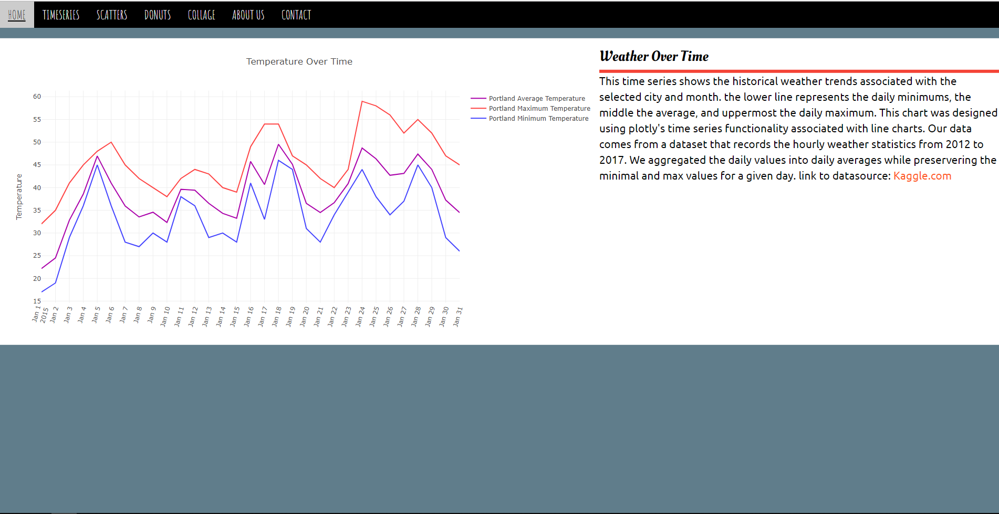

# [Travel-Informers] (https://travel-informers.herokuapp.com/)

## Goal

To create a travel aid that will let you know about weather and flight delays in certain destination cities.

### Member Responsibilities
* Chris Prabhu: Data and API Exploration, Graphs
* Corey Clippinger: SQL Server, Weather Data Cleaning, Wikipedia Scrape Script
* Gazelle Bahramianfard: Front End HTML, CSS, and JavaScripting
* Kevin McNalley: Leader, Back End flask app, Git management and Heroku Deploy

